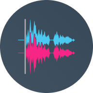
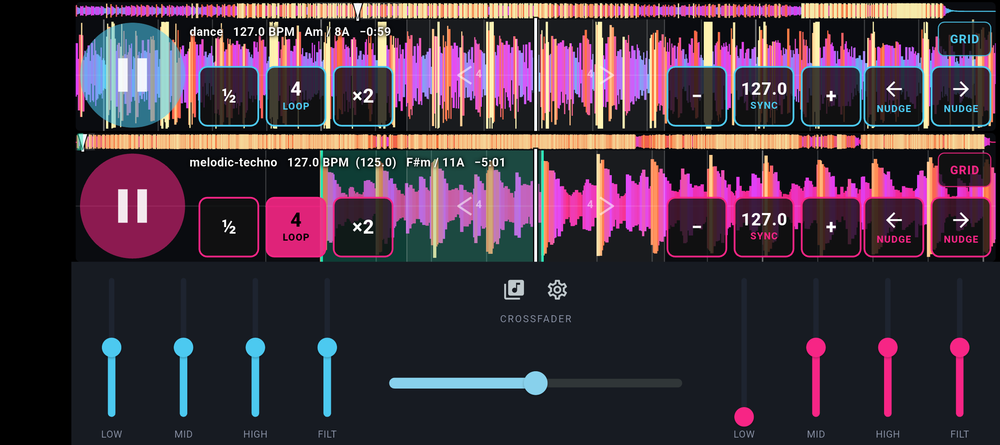

<p align="center">
  
</p>
<h2 align="center"><b>SideDeck</b></h2>
<h4 align="center">Free DJ app for Android. Mix on your phone, or on hardware.</h4>

<p align="center">
  <a href="https://f-droid.org/packages/es.manifold.sidedeck"></a>
  <a href="https://play.google.com/store/apps/details?id=es.manifold.sidedeck"></a>
</p>

Android DJ deck for local files and a Subsonic music server. Landscape dual
decks, waveforms, and an internal mixer, or four-channel USB out to an
external mixer such as the Teenage Engineering EP-136 K.O. Sidekick.



## Requirements

- Flutter stable (SDK ^3.12) - see [install Flutter](https://docs.flutter.dev/get-started/install)
- Android NDK (ships with Flutter / Android Studio) - the audio engine is C++
- Android 8.0+ (API 26), arm64 recommended
- USB host support on the device if you use an external mixer

## Build

```bash
flutter pub get
flutter run -d <android-device>
```

Debug APK:

```bash
flutter build apk --debug
```

Output: `build/app/outputs/flutter-apk/app-debug.apk`

## What works today

- Dual-deck landscape UI (waveforms, no platters)
- Native Oboe engine, MP3 and WAV
- Internal mixer: 3-band EQ, filter, crossfader
- BPM / key analysis on load (cached in SQLite); Camelot labels
- Beat detector: Queen Mary TempoTrackV2 + Mixxx BeatUtils; key: Queen Mary GetKeyMode
- Sync, loops (½ / ×2 on the waveform), BPM ±0.1, temporary pitch bend
- Waveform tap jumps ±4 beats; GRID edits the beatgrid (1 beat or 5 ms)
- Local folder/file picker; sort; analyze missing or all
- Library highlights keys compatible with a loaded deck
- Subsonic browse and cache-to-file
- External USB mixer: Deck A → channels 1–2, Deck B → channels 3–4

Keylock (pitch-held tempo) is on by default. Cue points and hot cues exist
in the engine; those controls are not on the live UI yet.

## External mixer (EP-136)

1. Sidekick USB mode = **Multi** (not Controller)
2. SideDeck settings → **Use EP-136**
3. Speakers → Main, headphones → Cue on the hardware

The on-screen EQ and crossfader hide in this mode; you mix on the device.

## Subsonic

[Subsonic](http://www.subsonic.org/pages/api.jsp) is an API for a music
library you host yourself. Servers such as [Navidrome](https://www.navidrome.org/)
speak it. In Settings you can point SideDeck at that server, browse albums
and tracks, and download them to the phone to mix like local files.

## Flutter

SideDeck is a Flutter application (Dart UI + FFI into C++). Docs:
[flutter.dev](https://docs.flutter.dev/).

## Project layout

```
lib/                 Dart UI, controllers, Subsonic client, FFI
native/engine/       C++ Oboe engine, EQ, analysis
android/app/         Android host, USB AudioTrack output
third_party/         Oboe, Signalsmith, qm-dsp, dr_libs
test/                Dart tests
```

## License

SideDeck is free software under the [GNU GPL v3 or later](LICENSE).
Third-party licenses are listed in [NOTICE](NOTICE) and
[third_party/README.md](third_party/README.md).
